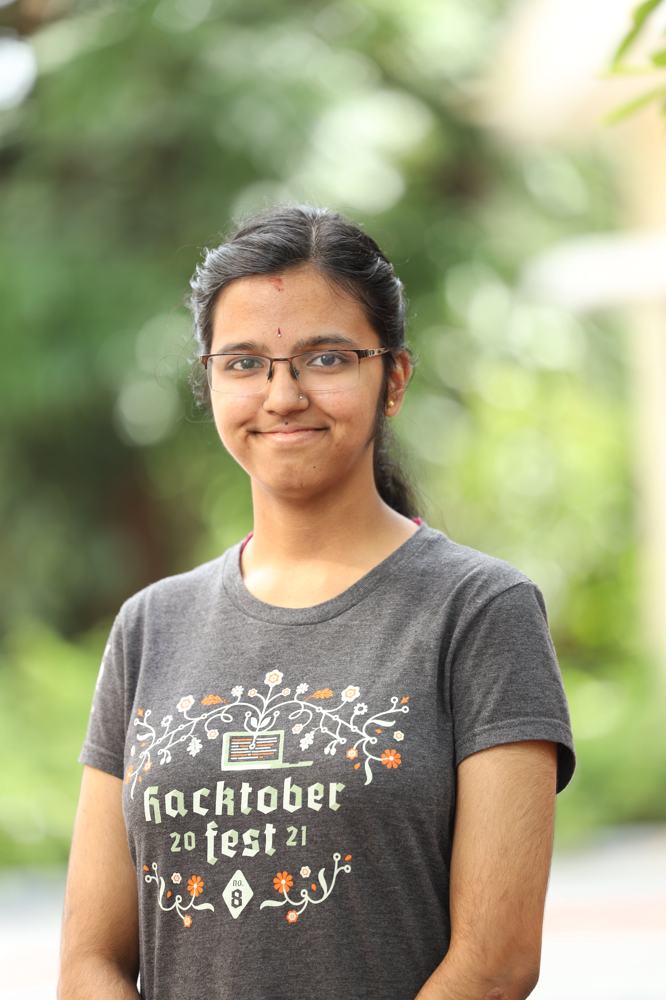

# FLC-Hackfest-2022 - Technoflash

## 📌 Problem Statement: 

There is a need to develop solutions to track all activities of a student including academic progress in real-time. Often it is observed that students are also good at co-curricular activities. In the current situation, it is not possible for a lecturer to pay attention to every student. Hence a web portal

- that tracks the student’s achievements in real-time by giving the students access to upload details with supporting documents, verified by the lecturers

- Allows lecturers to maintain the students' anecdotal record based on class behavior and presence

- Student’s academic performance maintained in the same platform (portal).

## Techstacks used 💻

Frontend - `HTML`, `CSS`, `JavaScript`, `Bootstrap`

Backend - `PHP (8.1.5)`

Distribution - `XAMPP (3.3.0)`

Database - `MySQL` 

Code Editor - `VSCode`

## Figma Design File 

<a href="https://drive.google.com/file/d/10tudXYHhKj4QX60Y6QvvpOJHEB2-DPvB/view?usp=sharing" target="_blank">Design File </a>

## Demo Video link (A walk through the website)

<a href="https://drive.google.com/file/d/1dEZfWDrJguHEaJNXq9LLgNIFS__MfFVW/view?usp=sharing">Project-Demo</a>

## Software Installation 

**Install Visual Studio Code :** 

https://code.visualstudio.com/download
   

**Download Xampp :**

https://www.apachefriends.org/download.html 

## Steps to run the project

**Clone the repo and put it in htdocs folder of xampp :** 

```bash
git clone https://github.com/pkini2002/FLC-Hackfest-Technoflash.git
```

```
xampp/htdocs/
```

**To run the server :**

Open Xampp Control Panel and Start Apache server and MySQL

```
localhost/
```

**Open PHPMyAdmin in the browser and import the database file-**
<br/><br/>
<p>Make sure to change the username,password and server port address in case you have a different one in db_conn.php file</p>
<br/>

```
localhost/phpmyadmin/
```

**Run the project in any browser**

(Ensure proper internet connection)

## Contributing to the project 

**Clone the repo and put it in htdocs folder of xampp :** 

```bash
git clone https://github.com/pkini2002/FLC-Hackfest-Technoflash.git
```

**Do necessary changes if any and add your code to the staging area**

```bash
git add .
```

**Commit the changes with a text message**

```bash
git commit -m "Message"
```

**Create a branch** 
```bash
git branch dev-branchname
```

**Push the code to your branch**
```bash
git push origin dev-branchname
```

**Finally create a pr and wait until your pr will be merged sucessfully!**

## Frontend Team
- Frontend Project Repo: <a href="https://github.com/SassyAjumma/Technoflash">Frontend-Repo </a>
<table>
  <tbody>
    <tr>
      <td align="center"><a href="https://github.com/Dhanya16"><br /><sub><b>Dhanya</b></sub></a><br /></td>
      <td align="center"><a href="https://github.com/ganapathi3689"><br /><sub><b>Ganapathi</b></sub></a><br /></td>  
      <td align="center"><a href="https://github.com/Mladeen"><br /><sub><b>Mladen Saldanha</b></sub></a><br /></td>
       <td align="center"><a href="https://github.com/SassyAjumma"><br /><sub><b>Pearl Menezes</b></sub></a><br /></td>
        <td align="center"><a href="https://github.com/preethampoojary"><br /><sub><b>Preetham Poojary</b></sub></a><br /></td>
         <td align="center"><a href="https://github.com/swapisticated"><br /><sub><b>Swapnil Sharma</b></sub></a><br /></td>
    </tr>
</tbody>
</table>

## Backend Team

<table>
  <tbody>
    <tr>
      <td align="center"><a href="https://github.com/pkini2002"><br /><sub><b>Prathiksha Kini</b></sub></a><br /></td>
      <td align="center"><a href="https://github.com/Vive007"><br /><sub><b>Vivek Kumar</b></sub></a><br /></td>  
    </tr>
</tbody>
</table>

